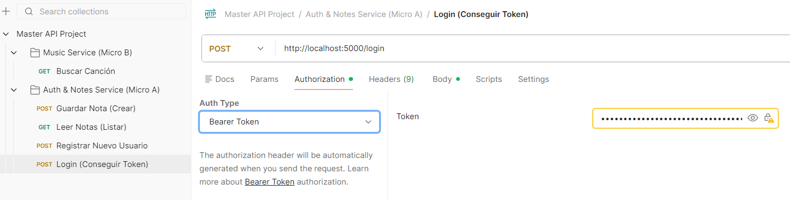

**🎵 Proyecto: Microservicios de Música**

**1. La Arquitectura**

- **El Concepto:** En lugar de un programa gigante que hace todo, tenemos pequeños programas especializados que hablan entre sí.
- **El Contenedor (Docker):** Cada servicio vive en su propia "caja" aislada. Tienen sus propias librerías, su propio sistema operativo y su propio puerto.
-----
**2. Servicios**

**🅰️ Microservicio A: auth\_service**

- **Rol:** Es el **Gestor y Archivero**.
- **Puerto:** 5000.
- **Memoria (Stateful):** Tiene una Base de Datos (notas.db). Recuerda quién eres y qué has escrito.
- **Responsabilidades:**
  - Gestionar Usuarios (Registro y Login).
  - Seguridad (Emitir y verificar Tokens JWT).
  - Guardar Notas (Persistencia).
  - **Orquestar:** Es quien decide llamar al otro servicio para pedir ayuda.

**🅱️ Microservicio B: music\_service (Los Sentidos)**

- **Rol:** Es el **Especialista Externo** (Proxy).
- **Puerto:** 5001.
- **Sin Memoria (Stateless):** No guarda nada. Si se apaga, no pierde datos importantes.
- **Responsabilidades:**
  - Tener las llaves de Spotify (CLIENT\_ID, SECRET).
  - Saber hablar con la API de Spotify.
  - Buscar canciones y devolver datos limpios (JSON).
-----
**3. La Comunicación**

**🗣️ Comunicación Interna (Docker Network)**

Cuando auth\_service necesita una foto:

- **El Truco:** Usamos el **nombre del contenedor** como si fuera una web.
- **Código:** requests.get('http://music\_service:5000/search?q=Queen').
- **Concepto:** **Data Enrichment** (Enriquecimiento de datos). El Servicio A tiene el texto, el Servicio B trae la imagen, y juntos crean un dato completo.
-----
**4. Base de Datos: Relaciones y SQL (SQLAlchemy)**

No hemos usado archivos de texto, hemos usado una **Base de Datos Relacional** (SQLite).

- **Tabla Usuario:** Guarda id, username, password.
- **Tabla Nota:** Guarda la canción, la foto.
- **La Clave Foránea (user\_id):** 
  - En la tabla Nota hay una columna user\_id podemos separar usuarios de notas pero mantenerlos vinculados.
-----
**5. Seguridad: El Flujo del Token (JWT)**

Hemos sustituido el método inseguro de "dime tu ID" por **Tokens**.

1. **Login (Autenticación):**
   1. El usuario envía user + password.
   2. El servidor comprueba la DB. Si es correcto, genera un **JWT** (una cadena de texto encriptada) firmada con tu SECRET\_KEY.
2. **Uso (Autorización):**
   1. El usuario quiere guardar una nota. Envía la nota + el **Token** en la cabecera.
   2. El servidor decodifica el token. Lee el user\_id que había escondido dentro.
   3. El servidor dice: *"Ah, este token es de María (ID 2)"* y guarda la nota a su nombre automáticamente.
-----
**6. Resumen del Flujo Completo (El viaje del dato)**

Cuando tú haces **POST /notas** en Postman, ocurre esta cadena de eventos en milisegundos:

1. **Postman:** Envía {"cancion": "Queen", ...} + **Token**.
1. **Auth Service (Entrada):**
   1. Recibe petición.
   1. Verifica Token -> "Es válido, es el usuario 1".
1. **Auth Service (Llamada Interna):**
   1. Se comunica con la red interna.
2. **Music Service:**
   1. Recibe la comunicacion de Auth Service.
   2. Usa las llaves para preguntar a **Spotify**.
   3. Spotify responde -> Music Service limpia el JSON -> Devuelve la URL de la foto.
3. **Auth Service (Guardado):**
   1. Recoge la foto.
   2. Junta: Texto  + ID del Token + Foto de Spotify.
   3. Escribe en notas.db.
4. **Respuesta:** Devuelve un JSON final: *"Guardado con éxito"*.
-----
**Ventajas**

1. **Seguridad:** Tus claves de Spotify están aisladas en un contenedor.
2. **Escalabilidad:** Se podría tener 5 contenedores de música si tenemos muchos usuarios, sin tocar la base de datos.
3. **Orden:** Si falla Spotify, no pierdes tus notas. Si se borra la base de datos, no pierdes la conexión con Spotify.

